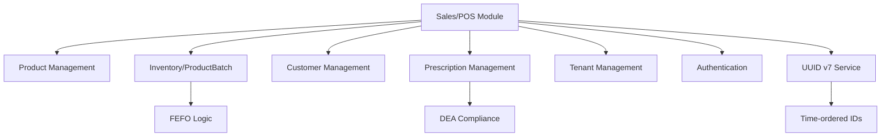
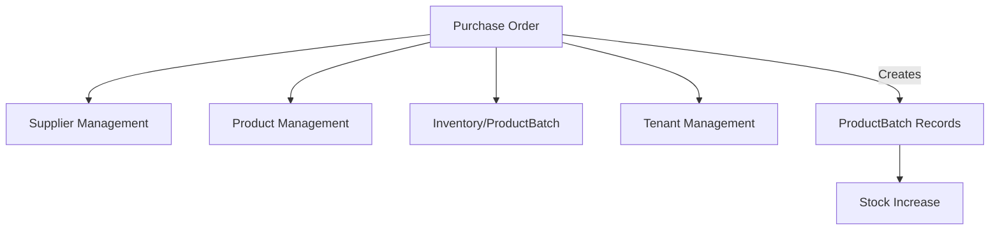

# Phase 4: Sales & Purchase Operations - Requirements Analysis

**Analysis Date:** 2025-01-12
**Analysis Type:** Comprehensive Requirements Analysis (--ultrathink)
**Focus:** Pre-implementation analysis for Phase 4 modules
**Status:** ⚠️ DO NOT IMPLEMENT YET - Analysis Only

---

## Executive Summary

Phase 4 represents the **most critical and complex phase** of the Pharmacy Management System implementation, introducing transactional operations that integrate all previous phases. This analysis identifies **8 major technical challenges**, **5 critical security risks**, and provides **11 detailed implementation recommendations** to ensure successful delivery.

**Key Findings:**
- ✅ Requirements are generally well-defined with clear success criteria
- ⚠️ **3 Schema Limitations** identified requiring workarounds or modifications
- 🔴 **5 Critical Risks** related to concurrency, compliance, and security
- 📊 Estimated effort (5 weeks) is **realistic but tight** given complexity

**Risk Level:** **HIGH** - Complex transactions, regulatory compliance, concurrent operations

---

## Table of Contents

1. [Module Overview](#module-overview)
2. [Dependency Analysis](#dependency-analysis)
3. [Technical Requirements Deep Dive](#technical-requirements-deep-dive)
   - [4.1 Sales/POS Module](#41-salespos-module)
   - [4.2 Purchase Order Module](#42-purchase-order-module)
4. [Technical Challenges & Risks](#technical-challenges--risks)
5. [Schema Limitations & Workarounds](#schema-limitations--workarounds)
6. [Security & Compliance Requirements](#security--compliance-requirements)
7. [Implementation Recommendations](#implementation-recommendations)
8. [Testing Strategy](#testing-strategy)
9. [Success Criteria & Validation](#success-criteria--validation)
10. [Development Timeline](#development-timeline)

---

## Module Overview

### 4.1 Sales/POS Module
- **Priority:** 🔴 Critical
- **Estimated Effort:** 3 weeks
- **Complexity:** High
- **Dependencies:** 6 modules (Products, Inventory, Customers, Prescriptions, Tenant, Auth)

### 4.2 Purchase Order Management
- **Priority:** 🟡 Medium
- **Estimated Effort:** 2 weeks
- **Complexity:** Medium
- **Dependencies:** 4 modules (Suppliers, Products, Inventory, Tenant)

**Total Phase Effort:** 5 weeks (Weeks 11-14)

---

## Dependency Analysis

### Sales/POS Module Dependencies



### Critical Integrations

| Integration | Type | Criticality | Notes |
|------------|------|-------------|-------|
| ProductBatch → Stock Levels | Read/Write | 🔴 Critical | FEFO selection, quantity updates |
| Prescription → Validation | Read/Write | 🔴 Critical | Controlled substance compliance |
| Customer → Insurance | Read | 🟡 High | Required for insurance claims |
| AuditLog → Compliance | Write | 🔴 Critical | DEA/regulatory requirements |
| Tenant → Isolation | Read | 🔴 Critical | Multi-tenant data separation |

### Purchase Order Module Dependencies



**Key Insight:** Phase 4 is the **integration culmination point** where all master data becomes operational.

---

## Technical Requirements Deep Dive

### 4.1 Sales/POS Module

#### Core Components

**File Structure:**
```
src/modules/sales/
├── sales.controller.ts          # REST API endpoints
├── sales.service.ts              # Core business logic (transaction orchestration)
├── sales.module.ts               # Module configuration
├── sale-item.service.ts          # Line item operations
├── dto/
│   ├── create-sale.dto.ts        # Sale creation validation
│   ├── sale-item.dto.ts          # Line item validation
│   └── return-sale.dto.ts        # Return/refund validation
└── utils/
    ├── invoice-generator.ts      # Invoice number generation
    └── receipt-generator.ts      # Receipt/PDF generation (advanced)
```

#### Feature Analysis

##### 1. Sale Creation with Multiple Items

**Requirements:**
- Single transaction must handle:
  - Sale record creation
  - Multiple SaleItem records
  - ProductBatch quantity updates (FEFO logic)
  - Prescription status updates (if applicable)
  - Payment record creation
  - Audit log creation

**Transaction Flow:**
```typescript
BEGIN TRANSACTION
  1. Generate UUID v7 for sale ID (time-ordered)
  2. Validate all products and stock availability
  3. Apply FEFO logic to select batches
  4. Create Sale record
  5. Create SaleItem records (potentially multiple per product if batch-spanning)
  6. Update ProductBatch.currentQuantity (with optimistic locking)
  7. Update Prescription.status to DISPENSED (if linked)
  8. Create PaymentMethod records
  9. Create AuditLog record
COMMIT or ROLLBACK on any failure
```

**Atomicity Requirement:** All operations must succeed or fail together. Partial sales are not acceptable.

##### 2. FEFO (First Expiry First Out) Logic

**Algorithm:**
```sql
-- Step 1: Query eligible batches
SELECT id, batchNumber, currentQuantity, expiryDate, sellingPrice
FROM ProductBatch
WHERE productId = ?
  AND tenantId = ?
  AND currentQuantity > 0
  AND expiryDate > CURRENT_DATE
  AND isActive = true
ORDER BY expiryDate ASC, createdAt ASC
```

**Allocation Logic:**
```
Customer wants: 100 units of Product X

Available batches:
  Batch A: 60 units (expires 2025-03-15) ← Select first
  Batch B: 80 units (expires 2025-04-20) ← Select second (40 units)
  Batch C: 50 units (expires 2025-06-10) ← Not needed

Allocation result:
  SaleItem 1: productId=X, batchId=A, quantity=60, price=batchA.sellingPrice
  SaleItem 2: productId=X, batchId=B, quantity=40, price=batchB.sellingPrice

Total: 2 SaleItem records created
```

**⚠️ Schema Limitation:** SaleItem has single `productBatchId` field. **Solution:** Create multiple SaleItem records (one per batch allocation).

##### 3. Invoice Number Generation

**Recommended Strategy: Hybrid Approach**

```
Format: {TenantCode}-{YYMMDD}-{UUID-Short}
Example: PHM-250112-A89E63C3

Components:
  - TenantCode: PHM (from Tenant.code)
  - YYMMDD: 250112 (date component for human sorting)
  - UUID-Short: A89E63C3 (8 chars from UUID v7 for uniqueness)

Benefits:
  ✅ Human-readable with date context
  ✅ Unique without sequence management
  ✅ No collision risk across tenants
  ✅ Sortable within same day
  ✅ Works in distributed systems
```

**Alternative: Pure UUID v7**
- Simpler implementation
- Not human-friendly for accounting
- Better for high-volume operations

##### 4. Prescription Validation

**Multi-Stage Validation Pipeline:**

**Stage 1: Existence & Ownership**
- Prescription exists in database
- Belongs to current tenant
- Includes customer information

**Stage 2: Status Validation**
- Status must be `ACTIVE`
- Not `DISPENSED`, `EXPIRED`, or `CANCELLED`

**Stage 3: Date Validation**
- `validUntil` > current date
- Not expired

**Stage 4: Product Matching**
- Product being sold exists in PrescriptionItem records
- Links prescription to specific medication

**Stage 5: Quantity Validation**
- Check prescribed quantity vs requested quantity
- Prevent over-dispensing
- ⚠️ **Schema Limitation:** No refill tracking

**Stage 6: DEA Schedule Compliance**

| DEA Schedule | Requirements | Validation |
|--------------|--------------|------------|
| Schedule II | No refills, exact quantity, original Rx only | Strictest validation |
| Schedule III-IV | Up to 5 refills, 6-month validity | Moderate validation, refill tracking needed |
| Schedule V | Relaxed controls | Basic validation |

**⚠️ Critical Gap:** Schema doesn't track:
- `refillsAllowed`
- `refillsUsed`
- `lastDispensedDate`

**Workaround:** Mark prescription as `DISPENSED` after first use. **Future:** Add refill fields to schema.

##### 5. Payment Processing

**Supported Methods:**
- CASH
- CARD (credit/debit)
- INSURANCE
- DIGITAL_WALLET

**Multi-Payment Support:**
```
Sale Total: $150.00
Payment 1: CASH $50.00
Payment 2: CARD $100.00

Creates 2 PaymentMethod records linked to sale
```

**Pricing Calculation:**
```
For each SaleItem:
  1. Base Price = ProductBatch.sellingPrice
  2. Item Subtotal = Base Price × Quantity
  3. Item Discount = Subtotal × (discount% / 100)
  4. Item After Discount = Subtotal - Item Discount
  5. Item Tax = Item After Discount × (tax% / 100)
  6. Item Total = Item After Discount + Item Tax

Sale Level:
  1. Subtotal = SUM(all Item Subtotals)
  2. Total Discount = SUM(all Item Discounts) + Sale-level discount
  3. Total After Discount = Subtotal - Total Discount
  4. Total Tax = SUM(all Item Tax)
  5. Grand Total = Total After Discount + Total Tax
  6. Amount Paid = SUM(all payment amounts)
  7. Change Due = Amount Paid - Grand Total (if > 0)
```

**🔒 Security Rule:** **NEVER accept prices from client.** Always fetch from database.

##### 6. Sale Returns & Cancellations

**Cancellation (Pre-Delivery):**
```
Sale created but not fulfilled
  → Update Sale.status = CANCELLED
  → Restore ProductBatch quantities
  → No refund processing needed
  → Create audit log
```

**Return (Post-Delivery):**
```
Sale completed and delivered
  → Validate: status = COMPLETED, within return window
  → Update Sale.status = RETURNED
  → Restore ProductBatch quantities (if acceptable condition)
  → Process refund
  → Update Prescription status if applicable
  → Create audit log
```

**⚠️ Schema Limitation:** No partial return support. Sale.status is single value (COMPLETED, RETURNED, CANCELLED).

**Workaround Options:**
1. Create negative sale (credit note) for partial returns ✅ Recommended
2. Add `returnQuantity` field to SaleItem
3. Add `PARTIAL_RETURN` to status enum
4. Link returns via `parentSaleId` reference

**Return Validation:**
- Can only return COMPLETED sales
- Return within policy timeframe (7/30 days)
- Check product condition (not damaged/expired)
- Controlled substances: special handling/documentation
- Insurance claims: may require reversal

---

### 4.2 Purchase Order Module

#### Core Components

**File Structure:**
```
src/modules/purchase-order/
├── purchase-order.controller.ts  # REST API endpoints
├── purchase-order.service.ts     # PO business logic
├── purchase-order.module.ts      # Module configuration
└── dto/
    ├── create-po.dto.ts          # Create PO with items
    ├── receive-po.dto.ts         # Receive goods (creates batches)
    └── cancel-po.dto.ts          # Cancel PO
```

#### Feature Analysis

##### 1. Purchase Order Creation

**Requirements:**
- Link to supplier
- Specify expected delivery date
- List products with quantities and costs
- Generate unique PO number
- Initial status: PENDING

**Business Rules:**
- Supplier must be active
- All products must exist and be valid
- Order quantities must be positive
- Cost prices must be specified

##### 2. Purchase Order Receiving

**⚠️ CRITICAL OPERATION:** This is the PRIMARY way inventory enters the system.

**Receiving Flow:**
```
Step 1: Validate PO
  - PO exists and status is PENDING
  - Cannot receive RECEIVED or CANCELLED POs

Step 2: For each received item:
  a. Validate product exists
  b. Capture batch information:
     - batchNumber (from supplier)
     - manufacturingDate
     - expiryDate ⚠️ CRITICAL for pharmacy operations
     - costPrice (from PO or actual invoice)
     - sellingPrice (apply markup formula)
  c. Create ProductBatch record:
     - initialQuantity = received quantity
     - currentQuantity = received quantity
     - isActive = true
  d. Update PurchaseOrderItem.receivedQuantity

Step 3: Check fulfillment
  - If receivedQuantity = orderedQuantity for all items:
    → Update PO status to RECEIVED
  - Else:
    → Keep status as PENDING (partial receive)

Step 4: Create audit log
```

**Partial Receiving Support:**
```
PO for 100 units

Shipment 1: Receive 60 units
  → Create ProductBatch with 60 units
  → PurchaseOrderItem.receivedQuantity = 60
  → PO status remains PENDING

Shipment 2: Receive 40 units
  → Create second ProductBatch with 40 units (different batch number)
  → PurchaseOrderItem.receivedQuantity = 100
  → PO status changes to RECEIVED (fully received)
```

**Transaction Management:**
```typescript
BEGIN TRANSACTION
  1. Lock PO record (prevent concurrent receives)
  2. For each received item:
     a. Create ProductBatch with UUID v7
     b. Update PurchaseOrderItem.receivedQuantity
  3. Check if all items fully received
  4. Update PO status if needed
  5. Create audit log
COMMIT or ROLLBACK
```

##### 3. Edge Cases

**Over-Receiving:**
- Ordered: 100 units, Received: 110 units
- **Options:**
  - Allow with adjustment (flexible)
  - Reject over-receiving (strict)
  - Allow with approval workflow (recommended)

**Under-Receiving:**
- Ordered: 100 units, Received: 90 units (final shipment)
- **Options:**
  - Mark as RECEIVED with discrepancy note
  - Create stock adjustment for missing quantity
  - Keep PENDING for potential future receipt

**Quality Rejection:**
- Received goods are damaged/defective
- **Options:**
  - Reject entire shipment (don't create batches)
  - Partial acceptance (create batches for good items only)
  - Accept all, then stock adjustment for DAMAGE

**Expiry Validation:**
- Validate minimum shelf life on receive
- Example: Reject items with < 6 months remaining
- Critical for pharmacy operations
- Prevent dead stock from short-dated goods

---

## Technical Challenges & Risks

### Challenge 1: Race Conditions in Concurrent Sales 🔴 CRITICAL

**Problem:** Multiple cashiers selling same product simultaneously.

**Scenario:**
```
T0: Batch has 10 units available
T1: Cashier A reads stock: 10 available ✓
T2: Cashier B reads stock: 10 available ✓
T3: Cashier A sells 8 units → Batch now has 2
T4: Cashier B tries to sell 8 units → PROBLEM!
```

**Risk:** Over-selling beyond available stock, negative inventory.

**Impact:** 🔴 CRITICAL
- Inventory inaccuracy
- Compliance issues
- Customer dissatisfaction
- Reputation damage

**Mitigation Strategies:**

**1. Optimistic Locking (Recommended):**
```typescript
await tx.productBatch.update({
  where: {
    id: batchId,
    currentQuantity: expectedQuantity  // Lock condition
  },
  data: {
    currentQuantity: { decrement: soldQuantity }
  }
});
// If expectedQuantity doesn't match → Prisma throws error → Rollback → Retry
```

**2. Pessimistic Locking:**
```sql
SELECT * FROM ProductBatch WHERE id = ? FOR UPDATE;
-- Locks row until transaction completes
```

**3. Retry Logic with Exponential Backoff:**
```typescript
async createSaleWithRetry(dto: CreateSaleDto, maxRetries = 3) {
  for (let attempt = 0; attempt < maxRetries; attempt++) {
    try {
      return await this.createSale(dto);
    } catch (error) {
      if (error instanceof OptimisticLockError && attempt < maxRetries - 1) {
        await this.delay(2 ** attempt * 100); // Exponential backoff
        continue;
      }
      throw error;
    }
  }
}
```

**Recommendation:** Use **optimistic locking** for better performance with retry logic.

---

### Challenge 2: FEFO Logic with Batch Spanning 🟡 MEDIUM

**Problem:** Customer quantity exceeds single batch capacity, but schema limits SaleItem to single `productBatchId`.

**Scenario:**
```
Customer wants: 100 units
Batch A: 60 units (expires 2025-03-15)
Batch B: 80 units (expires 2025-04-20)

FEFO requires:
  Take 60 from Batch A
  Take 40 from Batch B

But: SaleItem has single productBatchId field
```

**Impact:** 🟡 MEDIUM
- Cannot fulfill larger orders
- Violates FEFO principles if forced to single batch
- Inventory management inefficiency

**Solutions:**

**Option 1: Multiple SaleItem Records ✅ RECOMMENDED**
```typescript
// Create 2 SaleItem records for 1 product line
SaleItem 1: productId=X, batchId=A, quantity=60
SaleItem 2: productId=X, batchId=B, quantity=40

// Total shown to customer as 1 line: Product X × 100 units
```

**Pros:**
- Works with current schema
- Maintains FEFO integrity
- Proper batch tracking

**Cons:**
- More database records
- Display logic complexity (group by product in UI)

**Option 2: Limit Sale to Single Batch**
```typescript
// Max sale quantity = batch.currentQuantity
// Customer must make multiple purchases for larger quantities
```

**Pros:**
- Simple implementation
- No schema changes

**Cons:**
- Poor user experience
- Limits business operations

**Option 3: Schema Modification**
```prisma
// Add junction table for batch allocations
model SaleItemBatchAllocation {
  id            String   @id @default(cuid())
  saleItemId    String
  batchId       String
  quantity      Int
  saleItem      SaleItem      @relation(fields: [saleItemId])
  productBatch  ProductBatch  @relation(fields: [batchId])
}
```

**Pros:**
- Cleanest data model
- Flexible for complex scenarios

**Cons:**
- Requires schema change (out of scope)
- More complex queries

**Recommendation:** **Option 1** - Works within constraints, maintains business requirements.

---

### Challenge 3: Prescription Refill Tracking 🔴 HIGH

**Problem:** Schema doesn't support prescription refills required for DEA Schedule III-IV substances.

**Current Schema:**
```prisma
model Prescription {
  status PrescriptionStatus  // ACTIVE, DISPENSED, EXPIRED, CANCELLED
  // No refill tracking fields
}
```

**Regulatory Requirement:**
- Schedule III-IV: Up to 5 refills within 6 months
- Need to track: refills allowed, refills used, last dispensed date

**Impact:** 🔴 HIGH
- Compliance violation
- Cannot support refillable prescriptions
- Business limitation for common scenarios

**Solutions:**

**Option 1: Schema Extension (Ideal but out of scope)**
```prisma
model Prescription {
  status             PrescriptionStatus
  refillsAllowed     Int      @default(0)
  refillsUsed        Int      @default(0)
  lastDispensedDate  DateTime?
  // Status DISPENSED only when refillsUsed >= refillsAllowed
}
```

**Option 2: Track via Multiple Sales (Workaround)**
```
- Keep prescription ACTIVE after first dispense
- Track dispensing through Sale records
- Count sales linked to prescription
- Manual refill limit checking
```

**Option 3: Use Prescription.notes JSON field**
```typescript
notes: {
  refillsAllowed: 5,
  refillsUsed: 1,
  dispensingHistory: [
    { date: "2025-01-12", saleId: "...", quantity: 30 }
  ]
}
```

**Recommendation for Phase 4:**
- **Document limitation clearly**
- Implement **Option 3** (JSON tracking) as interim solution
- Flag for schema enhancement in future phase
- Ensure compliance through manual validation

---

### Challenge 4: Partial Returns Schema Limitation 🟡 MEDIUM

**Problem:** Sale.status is single enum value, cannot represent partial returns.

**Scenario:**
```
Sale with 3 items:
  Item A: $50
  Item B: $30
  Item C: $20

Customer returns Item B only → What status?
  COMPLETED? (Inaccurate - return occurred)
  RETURNED? (Inaccurate - only partial)
```

**Impact:** 🟡 MEDIUM
- Financial discrepancies
- Inventory inaccuracies
- Accounting complexity

**Solution: Credit Note Pattern ✅ RECOMMENDED**
```typescript
// Create negative sale for returned items
async partialReturn(originalSaleId: string, returnedItemIds: string[]) {
  return await this.prisma.$transaction(async (tx) => {
    // 1. Create new sale with RETURNED status
    const creditNote = await tx.sale.create({
      data: {
        invoiceNumber: `CN-${originalSale.invoiceNumber}`,
        status: 'RETURNED',
        totalAmount: -returnedItemsTotal, // Negative amount
        originalSaleId: originalSaleId,   // Link to original
        // ... other fields
      }
    });

    // 2. Create negative SaleItems for returned products
    // 3. Restore ProductBatch quantities
    // 4. Process refund

    // Original sale remains COMPLETED status
  });
}
```

**Benefits:**
- Works with current schema
- Standard accounting practice (credit notes)
- Complete audit trail
- Original sale integrity maintained

---

### Challenge 5: Transaction Timeout Risk 🟡 MEDIUM

**Problem:** Complex sale transaction with many operations may timeout or deadlock.

**Operations in Single Transaction:**
1. Create Sale (1 insert)
2. Create SaleItems (N inserts)
3. Query ProductBatches (N queries with FEFO)
4. Update ProductBatch quantities (N updates with locks)
5. Update Prescription status (1 update)
6. Create PaymentMethod records (M inserts)
7. Create AuditLog (1 insert)

**Total:** 2N + M + 3 database operations

**Risk Factors:**
- Large order (N = 50 items)
- High concurrency (10+ simultaneous sales)
- Complex FEFO with many batches per product
- Database connection pool exhaustion

**Impact:** 🟡 MEDIUM
- Transaction failures
- Inconsistent data state
- Poor user experience
- System unavailability

**Mitigation Strategies:**

**1. Optimize Queries:**
```typescript
// Batch query all product batches upfront
const allBatches = await tx.productBatch.findMany({
  where: {
    productId: { in: productIds },
    tenantId: tenantId,
    expiryDate: { gt: new Date() },
    currentQuantity: { gt: 0 }
  },
  orderBy: [{ expiryDate: 'asc' }, { createdAt: 'asc' }]
});
```

**2. Set Appropriate Timeouts:**
```typescript
await this.prisma.$transaction(
  async (tx) => { /* operations */ },
  {
    maxWait: 5000,   // Max 5s to acquire transaction
    timeout: 10000,  // Max 10s for transaction to complete
  }
);
```

**3. Database Indexing:**
```prisma
model ProductBatch {
  // Composite index for FEFO queries
  @@index([tenantId, productId, expiryDate, currentQuantity, isActive])
}
```

**4. Monitor Performance:**
```typescript
const startTime = Date.now();
try {
  await createSale(dto);
  const duration = Date.now() - startTime;
  logger.info('Sale created', { duration, itemCount: dto.items.length });

  if (duration > 3000) {
    logger.warn('Slow sale transaction', { duration });
  }
} catch (error) {
  const duration = Date.now() - startTime;
  logger.error('Sale transaction failed', { duration, error });
}
```

---

### Challenge 6-8: Additional Considerations

**Challenge 6: Insurance Claim Processing** (🟢 LOW)
- Documented as advanced feature
- Phase 4 will record insurance payments only
- Actual claim submission: future enhancement

**Challenge 7: Barcode Scanning Integration** (🟢 LOW)
- Schema supports barcode field
- Assumption: standard formats (UPC, EAN-13)
- Hardware integration: future phase

**Challenge 8: Performance with Large Volume** (🟡 MEDIUM)
- Expected: 100+ sales/hour in busy pharmacy
- Mitigation: proper indexing, caching, async audit logs

---

## Schema Limitations & Workarounds

### Summary Table

| Limitation | Impact | Workaround | Future Fix |
|-----------|--------|------------|------------|
| SaleItem single productBatchId | Cannot span batches | Multiple SaleItem records per product | Junction table |
| No prescription refill tracking | Cannot support Schedule III-IV refills | JSON field tracking or multiple sales | Add refill fields |
| Sale status single value | No partial returns | Credit note pattern (negative sale) | Add PARTIAL_RETURN status |
| No returnQuantity on SaleItem | Cannot track partial item returns | Credit note for returned items | Add returnQuantity field |
| No receivedDate on PO items | Cannot track when each item received | Use PO-level receivedDate | Add receivedDate to PurchaseOrderItem |

### Recommendations

**For Phase 4 Implementation:**
1. ✅ Use workarounds that don't require schema changes
2. ✅ Document limitations clearly in code comments
3. ✅ Flag schema enhancements for future phases
4. ✅ Ensure workarounds maintain data integrity
5. ✅ Test workarounds thoroughly

**For Future Schema Enhancement:**
1. Add refill tracking to Prescription
2. Add PARTIAL_RETURN to Sale status enum
3. Consider junction table for batch allocations
4. Add item-level received dates for POs

---

## Security & Compliance Requirements

### Security Risks

#### Risk 1: Multi-Tenant Data Leakage 🔴 CRITICAL

**Threat:** Tenant A accessing Tenant B's sales or inventory data.

**Attack Vectors:**
- Missing `tenantId` filter in queries
- JWT token manipulation
- Direct UUID guessing (if exposed in URLs)
- Horizontal privilege escalation

**Mitigation:**

**1. Mandatory Tenant Middleware:**
```typescript
@Injectable()
export class TenantMiddleware implements NestMiddleware {
  use(req: any, res: any, next: () => void) {
    const tenantId = this.extractTenantFromJWT(req);

    if (!tenantId) {
      throw new UnauthorizedException('Tenant context required');
    }

    req.tenantId = tenantId;
    next();
  }
}
```

**2. Never Trust Client-Provided tenantId:**
```typescript
// ❌ BAD
async createSale(@Body() dto: CreateSaleDto) {
  // dto.tenantId from client - NEVER trust this
}

// ✅ GOOD
async createSale(@Body() dto: CreateSaleDto, @TenantId() tenantId: string) {
  // tenantId from JWT via decorator - Safe
}
```

**3. Automated Tests:**
```typescript
describe('Tenant Isolation', () => {
  it('should prevent cross-tenant sale access', async () => {
    // Create sale in Tenant A
    const sale = await createSale(tenantA.id, saleDto);

    // Try to access from Tenant B
    await expect(
      getSale(sale.id, tenantB.id)
    ).rejects.toThrow(NotFoundException);
  });
});
```

---

#### Risk 2: Controlled Substance Audit Trail Gaps 🔴 HIGH

**Threat:** Incomplete or missing audit logs for DEA Schedule II-V products.

**Regulatory Requirement:** DEA requires complete chain of custody documentation.

**Impact:** Federal compliance violation, license suspension, legal liability.

**Mitigation:**

**1. Mandatory Audit Interceptor:**
```typescript
@UseInterceptors(AuditLogInterceptor)
@Controller('sales')
export class SalesController {
  @Post()
  async createSale(...) { /* auto-audited */ }
}
```

**2. Enhanced Logging for Controlled Substances:**
```typescript
async createSale(dto: CreateSaleDto) {
  const sale = await this.prisma.$transaction(async (tx) => {
    // ... create sale logic

    // Check if any controlled substances
    const controlledItems = items.filter(i =>
      i.product.deaSchedule !== null
    );

    if (controlledItems.length > 0) {
      // Create detailed audit log
      await tx.auditLog.create({
        data: {
          entityType: 'CONTROLLED_SUBSTANCE_SALE',
          entityId: sale.id,
          action: 'DISPENSE',
          userId: currentUser.id,
          tenantId: tenantId,
          metadata: {
            prescriptionId: dto.prescriptionId,
            deaSchedules: controlledItems.map(i => i.product.deaSchedule),
            quantities: controlledItems.map(i => i.quantity),
            customerInfo: { /* redacted PII */ },
            dispensedBy: currentUser.fullName,
            pharmacistLicense: currentUser.licenseNumber,
          }
        }
      });
    }
  });
}
```

**3. Immutable Audit Logs:**
- Append-only logs (no updates/deletes)
- Separate audit database or write-once storage
- Regular exports for compliance reporting

---

#### Risk 3: Price Manipulation 🔴 HIGH

**Threat:** Cashier or attacker modifies prices to steal revenue.

**Attack Vectors:**
- Client sends modified prices in sale request
- API doesn't validate against product master price
- Discount abuse (100% discount = free products)

**Mitigation:**

**1. Never Accept Prices from Client:**
```typescript
// DTO should NOT include prices
export class SaleItemDto {
  @IsUUID()
  productId: string;

  @IsInt()
  @Min(1)
  quantity: number;

  // ❌ DO NOT include:
  // unitPrice: number;  // NEVER trust client price
}
```

**2. Always Fetch from Database:**
```typescript
async createSale(dto: CreateSaleDto) {
  const items = [];

  for (const itemDto of dto.items) {
    // Fetch authoritative price from database
    const batch = await this.selectBatchFEFO(itemDto.productId);

    items.push({
      productId: itemDto.productId,
      batchId: batch.id,
      quantity: itemDto.quantity,
      unitPrice: batch.sellingPrice, // From database, not client
    });
  }
}
```

**3. Validate Discounts:**
```typescript
@IsOptional()
@IsNumber()
@Min(0)
@Max(50) // Maximum 50% discount without approval
discountPercentage?: number;

// In service:
if (dto.discountPercentage > 50) {
  if (!await this.hasManagerApproval(currentUser)) {
    throw new UnauthorizedException('Manager approval required for large discounts');
  }
}
```

**4. Audit Price Changes:**
```typescript
// Log all discounts
await this.auditService.log({
  action: 'DISCOUNT_APPLIED',
  entityId: sale.id,
  metadata: {
    originalTotal: subtotal,
    discountPercent: dto.discountPercentage,
    discountAmount: discountAmount,
    finalTotal: total,
    appliedBy: currentUser.id,
  }
});
```

---

### Compliance Requirements

#### DEA Controlled Substance Regulations

**Schedule II (Highest Control):**
- ✅ No refills allowed
- ✅ Original prescription required
- ✅ Dispensed within 30 days (typically)
- ✅ Exact quantity matching
- ✅ Mandatory detailed audit logging
- ✅ Pharmacist verification required

**Schedule III-IV:**
- ⚠️ Up to 5 refills within 6 months
- ⚠️ Refill tracking (schema limitation)
- ✅ Prescription validation
- ✅ Audit logging

**Schedule V:**
- ✅ Relaxed controls
- ✅ Basic prescription validation
- ✅ Audit logging

#### Implementation Checklist

- [ ] Prescription validation enforced for all controlled substances
- [ ] DEA Schedule-specific validation rules implemented
- [ ] Comprehensive audit logging for all dispensing
- [ ] Pharmacist role enforcement for Schedule II
- [ ] Refill tracking (interim solution via JSON field)
- [ ] Audit log export capability for DEA reporting
- [ ] Immutable audit logs (append-only)
- [ ] Regular compliance validation tests

---

## Implementation Recommendations

### Recommendation 1: Transaction Management Pattern ⭐ CRITICAL

**Use Prisma Transactions with Proper Configuration:**

```typescript
async createSale(dto: CreateSaleDto, currentUser: User, tenantId: string) {
  return await this.prisma.$transaction(
    async (tx) => {
      // 1. Generate UUID v7 for time-ordered ID
      const saleId = this.uuidService.generateV7();

      // 2. Allocate batches with FEFO logic
      const batchAllocations = await this.allocateBatchesWithFEFO(
        dto.items,
        tenantId,
        tx
      );

      // 3. Validate stock availability
      this.validateSufficientStock(batchAllocations, dto.items);

      // 4. Validate prescription if required
      if (dto.prescriptionId) {
        await this.validatePrescription(dto.prescriptionId, dto.items, tx);
      }

      // 5. Create Sale record
      const sale = await tx.sale.create({
        data: {
          id: saleId,
          invoiceNumber: await this.generateInvoiceNumber(tenantId),
          tenantId,
          customerId: dto.customerId,
          prescriptionId: dto.prescriptionId,
          userId: currentUser.id,
          // ... calculate totals
        }
      });

      // 6. Create SaleItems (multiple per product if batch-spanning)
      for (const allocation of batchAllocations) {
        await tx.saleItem.create({
          data: {
            saleId: sale.id,
            productId: allocation.productId,
            productBatchId: allocation.batchId,
            quantity: allocation.quantity,
            unitPrice: allocation.unitPrice,
            // ... calculate item totals
          }
        });
      }

      // 7. Update batch quantities with optimistic locking
      for (const allocation of batchAllocations) {
        const updateResult = await tx.productBatch.updateMany({
          where: {
            id: allocation.batchId,
            currentQuantity: allocation.expectedQuantity, // Optimistic lock
          },
          data: {
            currentQuantity: {
              decrement: allocation.quantity
            }
          }
        });

        if (updateResult.count === 0) {
          throw new OptimisticLockException(
            `Concurrent modification detected on batch ${allocation.batchId}`
          );
        }
      }

      // 8. Update prescription status if linked
      if (dto.prescriptionId) {
        await tx.prescription.update({
          where: { id: dto.prescriptionId },
          data: { status: 'DISPENSED' }
        });
      }

      // 9. Create payment records
      for (const payment of dto.payments) {
        await tx.paymentMethod.create({
          data: {
            saleId: sale.id,
            method: payment.method,
            amount: payment.amount,
          }
        });
      }

      // 10. Create audit log
      await tx.auditLog.create({
        data: {
          entityType: 'SALE',
          entityId: sale.id,
          action: 'CREATE',
          userId: currentUser.id,
          tenantId: tenantId,
          newValues: sale,
        }
      });

      return sale;
    },
    {
      isolationLevel: 'ReadCommitted', // Prevent dirty reads
      maxWait: 5000,   // 5 seconds max wait for lock acquisition
      timeout: 10000,  // 10 seconds max transaction duration
    }
  );
}
```

**Key Points:**
- ✅ Single atomic transaction
- ✅ UUID v7 for time-ordered IDs
- ✅ FEFO allocation before database writes
- ✅ Optimistic locking for concurrent safety
- ✅ Proper error handling
- ✅ Comprehensive audit logging

---

### Recommendation 2: FEFO Implementation with Batch Spanning ⭐ CRITICAL

```typescript
async allocateBatchesWithFEFO(
  items: SaleItemDto[],
  tenantId: string,
  tx: Prisma.TransactionClient
): Promise<BatchAllocation[]> {
  const allocations: BatchAllocation[] = [];

  for (const item of items) {
    let remainingQty = item.quantity;

    // Query batches with FEFO ordering
    const batches = await tx.productBatch.findMany({
      where: {
        productId: item.productId,
        tenantId: tenantId,
        currentQuantity: { gt: 0 },
        expiryDate: { gt: new Date() },
        isActive: true,
      },
      orderBy: [
        { expiryDate: 'asc' },  // First expiry first
        { createdAt: 'asc' }    // Oldest batch first (tie-breaker)
      ],
      select: {
        id: true,
        batchNumber: true,
        currentQuantity: true,
        expiryDate: true,
        sellingPrice: true,
      }
    });

    // Allocate across batches
    for (const batch of batches) {
      if (remainingQty <= 0) break;

      const allocateQty = Math.min(remainingQty, batch.currentQuantity);

      allocations.push({
        productId: item.productId,
        batchId: batch.id,
        batchNumber: batch.batchNumber,
        quantity: allocateQty,
        expectedQuantity: batch.currentQuantity, // For optimistic locking
        unitPrice: batch.sellingPrice,
        expiryDate: batch.expiryDate,
      });

      remainingQty -= allocateQty;
    }

    // Validate sufficient stock
    if (remainingQty > 0) {
      const availableQty = item.quantity - remainingQty;
      throw new InsufficientStockException(
        `Insufficient stock for product ${item.productId}. ` +
        `Requested: ${item.quantity}, Available: ${availableQty}`
      );
    }
  }

  return allocations;
}

interface BatchAllocation {
  productId: string;
  batchId: string;
  batchNumber: string;
  quantity: number;
  expectedQuantity: number;  // For optimistic locking
  unitPrice: number;
  expiryDate: Date;
}
```

**Benefits:**
- ✅ Implements FEFO correctly (expiry → creation date ordering)
- ✅ Handles batch spanning by creating multiple SaleItems
- ✅ Validates stock before writes
- ✅ Captures expected quantity for optimistic locking
- ✅ Clear error messages for insufficient stock

---

### Recommendation 3: Prescription Validation Pipeline ⭐ HIGH

```typescript
async validatePrescription(
  prescriptionId: string,
  items: SaleItemDto[],
  tx: Prisma.TransactionClient
): Promise<PrescriptionValidationResult> {

  // Stage 1: Fetch prescription with related data
  const prescription = await tx.prescription.findUnique({
    where: { id: prescriptionId },
    include: {
      prescriptionItems: {
        include: {
          product: true
        }
      },
      customer: true,
    }
  });

  if (!prescription) {
    throw new PrescriptionNotFoundException(prescriptionId);
  }

  // Stage 2: Status validation
  if (prescription.status !== 'ACTIVE') {
    throw new PrescriptionInactiveException(
      `Prescription status is ${prescription.status}, must be ACTIVE`
    );
  }

  // Stage 3: Date validation
  if (prescription.validUntil < new Date()) {
    throw new PrescriptionExpiredException(
      `Prescription expired on ${prescription.validUntil}`
    );
  }

  // Stage 4: Product matching and quantity validation
  for (const item of items) {
    const prescriptionItem = prescription.prescriptionItems.find(
      pi => pi.productId === item.productId
    );

    if (!prescriptionItem) {
      throw new ProductNotInPrescriptionException(
        `Product ${item.productId} not found in prescription`
      );
    }

    const product = prescriptionItem.product;

    // Stage 5: DEA Schedule validation
    if (product.deaSchedule === 'SCHEDULE_II') {
      // Schedule II: Strict quantity matching, no over-dispensing
      if (item.quantity > prescriptionItem.quantityPrescribed) {
        throw new ExceedsPrescribedQuantityException(
          `Cannot dispense ${item.quantity} units. ` +
          `Prescribed quantity: ${prescriptionItem.quantityPrescribed}`
        );
      }
    } else if (product.deaSchedule === 'SCHEDULE_III' ||
               product.deaSchedule === 'SCHEDULE_IV') {
      // Schedule III-IV: Check refills
      // TODO: Implement refill tracking when schema supports it
      // For now, use JSON field workaround
      const refillInfo = this.getRefillInfo(prescription);

      if (refillInfo.refillsUsed >= refillInfo.refillsAllowed) {
        throw new NoRefillsRemainingException(
          `No refills remaining. Used: ${refillInfo.refillsUsed}/${refillInfo.refillsAllowed}`
        );
      }
    }

    // Stage 6: Require prescription flag validation
    if (product.requiresPrescription && !prescriptionId) {
      throw new PrescriptionRequiredException(
        `Product "${product.name}" requires a valid prescription`
      );
    }
  }

  return {
    prescription,
    validated: true,
    warnings: [],
  };
}

// Interim refill tracking using JSON field
private getRefillInfo(prescription: Prescription): RefillInfo {
  const notes = prescription.notes as any;
  return {
    refillsAllowed: notes?.refillsAllowed ?? 0,
    refillsUsed: notes?.refillsUsed ?? 0,
  };
}
```

---

### Recommendation 4: Invoice Number Generation

```typescript
// src/modules/sales/utils/invoice-generator.service.ts

@Injectable()
export class InvoiceGeneratorService {
  constructor(
    private readonly uuidService: UuidService,
    private readonly prisma: PrismaService,
  ) {}

  /**
   * Generate invoice number with format: {TenantCode}-{YYMMDD}-{UUID-Short}
   * Example: PHM-250112-A89E63C3
   */
  async generateInvoiceNumber(tenantId: string): Promise<string> {
    // Fetch tenant code
    const tenant = await this.prisma.tenant.findUnique({
      where: { id: tenantId },
      select: { code: true }
    });

    if (!tenant) {
      throw new TenantNotFoundException(tenantId);
    }

    // Date component (YYMMDD)
    const now = new Date();
    const dateStr = format(now, 'yyMMdd');

    // UUID v7 short component (8 chars)
    const uuid = this.uuidService.generateV7();
    const shortUuid = uuid.substring(24, 32).toUpperCase();

    return `${tenant.code}-${dateStr}-${shortUuid}`;
  }

  /**
   * Validate invoice number format
   */
  isValidInvoiceNumber(invoiceNumber: string): boolean {
    const pattern = /^[A-Z0-9]+-\d{6}-[A-F0-9]{8}$/;
    return pattern.test(invoiceNumber);
  }

  /**
   * Extract date from invoice number
   */
  extractDateFromInvoice(invoiceNumber: string): Date {
    const parts = invoiceNumber.split('-');
    if (parts.length !== 3) {
      throw new InvalidInvoiceNumberException();
    }

    const dateStr = parts[1]; // YYMMDD
    return parse(dateStr, 'yyMMdd', new Date());
  }
}
```

**Benefits:**
- ✅ Human-readable with date context
- ✅ Unique without sequence management
- ✅ No collision risk
- ✅ Sortable within same day
- ✅ Tenant-scoped
- ✅ Works in distributed systems

---

### Recommendation 5: Audit Logging Strategy

```typescript
// src/modules/audit/interceptors/audit-log.interceptor.ts

@Injectable()
export class AuditLogInterceptor implements NestInterceptor {
  constructor(
    private readonly auditService: AuditService,
    private readonly reflector: Reflector,
  ) {}

  async intercept(
    context: ExecutionContext,
    next: CallHandler
  ): Observable<any> {
    const request = context.switchToHttp().getRequest();
    const { user, tenantId } = request;
    const handler = context.getHandler();

    // Check if auditing is enabled for this handler
    const skipAudit = this.reflector.get<boolean>(
      'skipAudit',
      handler
    );

    if (skipAudit) {
      return next.handle();
    }

    const startTime = Date.now();

    return next.handle().pipe(
      tap(async (response) => {
        const duration = Date.now() - startTime;

        // Async logging (don't block response)
        setImmediate(() => {
          this.auditService.log({
            entityType: this.extractEntityType(context),
            entityId: response?.id,
            action: this.mapMethodToAction(request.method),
            userId: user?.id,
            tenantId: tenantId,
            ipAddress: request.ip,
            userAgent: request.headers['user-agent'],
            duration,
            newValues: this.sanitize(response),
          }).catch(error => {
            // Log but don't throw - audit failure shouldn't break operations
            console.error('Audit logging failed:', error);
          });
        });
      })
    );
  }

  private extractEntityType(context: ExecutionContext): string {
    const controller = context.getClass().name;
    // SalesController → SALE
    return controller.replace('Controller', '').toUpperCase();
  }

  private mapMethodToAction(httpMethod: string): string {
    const mapping = {
      'POST': 'CREATE',
      'PUT': 'UPDATE',
      'PATCH': 'UPDATE',
      'DELETE': 'DELETE',
      'GET': 'READ',
    };
    return mapping[httpMethod] || 'UNKNOWN';
  }

  private sanitize(data: any): any {
    // Remove sensitive fields before logging
    const sanitized = { ...data };
    delete sanitized.password;
    delete sanitized.refreshToken;
    return sanitized;
  }
}

// Apply to controllers
@UseInterceptors(AuditLogInterceptor)
@Controller('sales')
export class SalesController { ... }

// Skip audit for specific methods if needed
@Get()
@SkipAudit()
async listSales() { ... }
```

---

### Recommendation 6-11: Additional Best Practices

**Recommendation 6: Error Handling**
- Use domain-specific exceptions with clear messages
- Include actionable information (available quantity, etc.)
- Proper HTTP status codes (422 for business logic errors)

**Recommendation 7: Input Validation**
- Strict DTO validation with class-validator
- Never accept prices/totals from client
- Validate discount ranges (0-50% without approval)

**Recommendation 8: Security Guards**
- Role-based access control (CASHIER, PHARMACIST, MANAGER)
- Tenant isolation enforcement
- Manager approval for high-value operations

**Recommendation 9: Performance Optimization**
- Composite indexes for FEFO queries
- Caching for product prices (5-minute TTL)
- Async audit logging (don't block responses)
- Connection pooling and query optimization

**Recommendation 10: Monitoring**
- Track key metrics (sales count, failures, durations)
- Alert on concurrent sale conflicts
- Monitor low stock and expiry warnings
- Business metrics for dashboards

**Recommendation 11: Testing**
- 80%+ unit test coverage
- Integration tests for transaction integrity
- E2E tests for critical flows
- Load testing for concurrent sales

---

## Testing Strategy

### Unit Tests (Target: 80%+ Coverage)

```typescript
describe('SalesService', () => {
  let service: SalesService;
  let prisma: MockPrismaService;

  beforeEach(async () => {
    const module = await Test.createTestingModule({
      providers: [
        SalesService,
        { provide: PrismaService, useClass: MockPrismaService },
        { provide: UuidService, useClass: MockUuidService },
      ],
    }).compile();

    service = module.get(SalesService);
    prisma = module.get(PrismaService);
  });

  describe('FEFO Allocation', () => {
    it('should select batch with earliest expiry date', async () => {
      // Arrange
      const batches = [
        { id: '1', expiryDate: new Date('2025-04-01'), qty: 100 },
        { id: '2', expiryDate: new Date('2025-03-01'), qty: 50 },
        { id: '3', expiryDate: new Date('2025-05-01'), qty: 75 },
      ];
      prisma.productBatch.findMany.mockResolvedValue(batches);

      // Act
      const allocations = await service.allocateBatches([
        { productId: 'p1', quantity: 30 }
      ]);

      // Assert
      expect(allocations[0].batchId).toBe('2'); // Earliest expiry (2025-03-01)
      expect(allocations[0].quantity).toBe(30);
    });

    it('should span multiple batches when needed', async () => {
      // Arrange
      const batches = [
        { id: '1', expiryDate: new Date('2025-03-01'), qty: 40 },
        { id: '2', expiryDate: new Date('2025-04-01'), qty: 100 },
      ];
      prisma.productBatch.findMany.mockResolvedValue(batches);

      // Act
      const allocations = await service.allocateBatches([
        { productId: 'p1', quantity: 80 }
      ]);

      // Assert
      expect(allocations).toHaveLength(2);
      expect(allocations[0]).toMatchObject({ batchId: '1', quantity: 40 });
      expect(allocations[1]).toMatchObject({ batchId: '2', quantity: 40 });
    });

    it('should throw error when insufficient stock', async () => {
      // Arrange
      prisma.productBatch.findMany.mockResolvedValue([
        { id: '1', expiryDate: new Date('2025-03-01'), qty: 30 }
      ]);

      // Act & Assert
      await expect(
        service.allocateBatches([{ productId: 'p1', quantity: 50 }])
      ).rejects.toThrow(InsufficientStockException);
    });

    it('should exclude expired batches', async () => {
      // Arrange
      const yesterday = new Date();
      yesterday.setDate(yesterday.getDate() - 1);

      prisma.productBatch.findMany.mockResolvedValue([
        { id: '1', expiryDate: yesterday, qty: 100 }, // Expired
        { id: '2', expiryDate: new Date('2025-12-31'), qty: 50 },
      ]);

      // Act
      const allocations = await service.allocateBatches([
        { productId: 'p1', quantity: 30 }
      ]);

      // Assert
      expect(allocations[0].batchId).toBe('2'); // Only non-expired
    });
  });

  describe('Prescription Validation', () => {
    it('should require active prescription for controlled substances', async () => {
      // Arrange
      prisma.product.findUnique.mockResolvedValue({
        id: 'p1',
        requiresPrescription: true,
        deaSchedule: 'SCHEDULE_II'
      });

      // Act & Assert
      await expect(
        service.createSale({ items: [{ productId: 'p1', quantity: 10 }] })
      ).rejects.toThrow(PrescriptionRequiredException);
    });

    it('should reject expired prescriptions', async () => {
      // Arrange
      const yesterday = new Date();
      yesterday.setDate(yesterday.getDate() - 1);

      prisma.prescription.findUnique.mockResolvedValue({
        id: 'rx1',
        status: 'ACTIVE',
        validUntil: yesterday
      });

      // Act & Assert
      await expect(
        service.validatePrescription('rx1', [])
      ).rejects.toThrow(PrescriptionExpiredException);
    });

    it('should prevent over-dispensing for Schedule II', async () => {
      // Arrange
      prisma.prescription.findUnique.mockResolvedValue({
        status: 'ACTIVE',
        validUntil: new Date('2025-12-31'),
        prescriptionItems: [
          { productId: 'p1', quantityPrescribed: 30, product: { deaSchedule: 'SCHEDULE_II' }}
        ]
      });

      // Act & Assert
      await expect(
        service.validatePrescription('rx1', [{ productId: 'p1', quantity: 40 }])
      ).rejects.toThrow(ExceedsPrescribedQuantityException);
    });
  });

  describe('Concurrent Sales', () => {
    it('should handle optimistic locking conflict', async () => {
      // Arrange
      prisma.productBatch.updateMany.mockResolvedValue({ count: 0 }); // Lock conflict

      // Act & Assert
      await expect(
        service.createSale(validSaleDto)
      ).rejects.toThrow(OptimisticLockException);
    });
  });
});
```

### Integration Tests (Target: 70%+ Coverage)

```typescript
describe('Sales API Integration', () => {
  let app: INestApplication;
  let prisma: PrismaService;

  beforeAll(async () => {
    const module = await Test.createTestingModule({
      imports: [AppModule],
    }).compile();

    app = module.createNestApplication();
    await app.init();

    prisma = module.get(PrismaService);
  });

  afterAll(async () => {
    await app.close();
  });

  describe('POST /sales', () => {
    it('should create sale and deduct stock atomically', async () => {
      // Arrange
      const product = await createTestProduct();
      const batch = await createTestBatch({ productId: product.id, qty: 100 });
      const initialStock = batch.currentQuantity;

      const saleDto = {
        items: [{ productId: product.id, quantity: 10 }],
        paymentMethod: 'CASH',
      };

      // Act
      const response = await request(app.getHttpServer())
        .post('/sales')
        .set('Authorization', `Bearer ${authToken}`)
        .send(saleDto)
        .expect(201);

      // Assert
      const updatedBatch = await prisma.productBatch.findUnique({
        where: { id: batch.id }
      });

      expect(updatedBatch.currentQuantity).toBe(initialStock - 10);
      expect(response.body.status).toBe('COMPLETED');
    });

    it('should enforce tenant isolation', async () => {
      // Arrange
      const tenantA = await createTestTenant('A');
      const tenantB = await createTestTenant('B');
      const productA = await createTestProduct({ tenantId: tenantA.id });
      const tokenB = await getAuthToken(tenantB.id);

      // Act - Tenant B tries to sell Tenant A's product
      const response = await request(app.getHttpServer())
        .post('/sales')
        .set('Authorization', `Bearer ${tokenB}`)
        .send({ items: [{ productId: productA.id, quantity: 1 }] })
        .expect(404); // Not found (tenant isolation)
    });

    it('should rollback on validation failure', async () => {
      // Arrange
      const product = await createTestProduct({ requiresPrescription: true });
      const batch = await createTestBatch({ productId: product.id, qty: 100 });
      const initialStock = batch.currentQuantity;

      const saleDto = {
        items: [{ productId: product.id, quantity: 10 }],
        // Missing prescription!
      };

      // Act
      await request(app.getHttpServer())
        .post('/sales')
        .set('Authorization', `Bearer ${authToken}`)
        .send(saleDto)
        .expect(422);

      // Assert - Stock not deducted due to rollback
      const batch2 = await prisma.productBatch.findUnique({
        where: { id: batch.id }
      });
      expect(batch2.currentQuantity).toBe(initialStock);
    });
  });
});
```

### E2E Tests (Critical Flows)

```typescript
describe('Complete Sales Flow E2E', () => {
  it('should complete purchase-to-sale workflow', async () => {
    // 1. Create supplier
    const supplier = await createSupplier({
      name: 'Test Pharma Supplier',
      code: 'SUP001'
    });

    // 2. Create product
    const product = await createProduct({
      name: 'Test Medicine',
      code: 'MED001',
      requiresPrescription: false
    });

    // 3. Create and receive PO
    const po = await createPurchaseOrder({
      supplierId: supplier.id,
      items: [{
        productId: product.id,
        quantity: 100,
        costPrice: 10.00
      }]
    });

    await receivePurchaseOrder(po.id, {
      items: [{
        productId: product.id,
        receivedQuantity: 100,
        batchNumber: 'BATCH001',
        expiryDate: '2025-12-31'
      }]
    });

    // 4. Verify batch created
    const batches = await prisma.productBatch.findMany({
      where: { productId: product.id }
    });
    expect(batches).toHaveLength(1);
    expect(batches[0].currentQuantity).toBe(100);

    // 5. Create sale
    const sale = await createSale({
      items: [{ productId: product.id, quantity: 10 }],
      paymentMethod: 'CASH'
    });

    expect(sale.status).toBe('COMPLETED');

    // 6. Verify stock deducted
    const batch = await prisma.productBatch.findUnique({
      where: { id: batches[0].id }
    });
    expect(batch.currentQuantity).toBe(90);

    // 7. Verify audit logs created
    const auditLogs = await prisma.auditLog.findMany({
      where: {
        entityId: { in: [po.id, sale.id] }
      }
    });
    expect(auditLogs.length).toBeGreaterThanOrEqual(2);
  });

  it('should handle prescription workflow', async () => {
    // 1. Create controlled substance product
    const product = await createProduct({
      name: 'Controlled Medicine',
      requiresPrescription: true,
      deaSchedule: 'SCHEDULE_II'
    });

    // 2. Create customer
    const customer = await createCustomer({
      name: 'John Doe',
      phone: '555-0100'
    });

    // 3. Create prescription
    const prescription = await createPrescription({
      customerId: customer.id,
      doctorName: 'Dr. Smith',
      validUntil: new Date('2025-12-31'),
      items: [{
        productId: product.id,
        quantityPrescribed: 30,
        dosage: '10mg',
        frequency: 'Once daily'
      }]
    });

    expect(prescription.status).toBe('ACTIVE');

    // 4. Create batch
    await receivePurchaseOrder(poId, {
      items: [{
        productId: product.id,
        receivedQuantity: 100,
        batchNumber: 'CTRL001',
        expiryDate: '2025-12-31'
      }]
    });

    // 5. Create sale with prescription
    const sale = await createSale({
      customerId: customer.id,
      prescriptionId: prescription.id,
      items: [{ productId: product.id, quantity: 30 }]
    });

    expect(sale.status).toBe('COMPLETED');

    // 6. Verify prescription marked as dispensed
    const updatedPrescription = await prisma.prescription.findUnique({
      where: { id: prescription.id }
    });
    expect(updatedPrescription.status).toBe('DISPENSED');

    // 7. Verify controlled substance audit log
    const auditLog = await prisma.auditLog.findFirst({
      where: {
        entityType: 'CONTROLLED_SUBSTANCE_SALE',
        entityId: sale.id
      }
    });
    expect(auditLog).toBeDefined();
    expect(auditLog.metadata).toHaveProperty('deaSchedules');
  });
});
```

### Load Testing

```typescript
describe('Concurrent Sales Load Test', () => {
  it('should handle 100 concurrent sales without data corruption', async () => {
    // Arrange
    const product = await createProduct();
    const batch = await createTestBatch({
      productId: product.id,
      currentQuantity: 1000
    });

    // Act - 100 concurrent sales of 1 unit each
    const promises = Array.from({ length: 100 }, (_, i) =>
      createSale({
        items: [{ productId: product.id, quantity: 1 }]
      })
    );

    const results = await Promise.allSettled(promises);

    // Assert
    const successes = results.filter(r => r.status === 'fulfilled');
    const failures = results.filter(r => r.status === 'rejected');

    console.log(`Successes: ${successes.length}, Failures: ${failures.length}`);

    // Verify final stock is correct
    const finalBatch = await prisma.productBatch.findUnique({
      where: { id: batch.id }
    });

    expect(finalBatch.currentQuantity).toBe(1000 - successes.length);

    // All operations should succeed (no race conditions)
    expect(successes.length).toBe(100);
    expect(failures.length).toBe(0);
  });
});
```

---

## Success Criteria & Validation

### Phase 4 Completion Checklist

#### Sales/POS Module

**Core Features:**
- [ ] Create sale with multiple items
- [ ] Automatic invoice number generation (hybrid format)
- [ ] FEFO batch selection with cross-batch allocation
- [ ] Stock deduction with optimistic locking
- [ ] Multiple payment methods support
- [ ] Prescription validation for controlled substances
- [ ] DEA Schedule-specific validation
- [ ] Customer linking (optional/required for insurance)
- [ ] Discount application (item + sale level)
- [ ] Tax calculation
- [ ] Sale returns (credit note pattern)
- [ ] Sale cancellations
- [ ] Audit logging for all operations

**Business Rules:**
- [ ] Validate stock availability before sale
- [ ] Check expiry dates (no expired batches)
- [ ] Require prescription for controlled substances
- [ ] Prevent over-dispensing prescribed quantities
- [ ] Update prescription status after dispensing
- [ ] Prevent cross-tenant data access

**Quality Gates:**
- [ ] 80%+ unit test coverage
- [ ] 70%+ integration test coverage
- [ ] E2E tests for critical flows pass
- [ ] Load test: 100 concurrent sales succeed
- [ ] Zero race conditions in concurrent sales
- [ ] Transaction rollback on any failure
- [ ] Proper error messages for all validations

**Security:**
- [ ] Tenant isolation enforced
- [ ] Prices fetched from database (never client)
- [ ] Role-based access control
- [ ] Comprehensive audit logging
- [ ] Controlled substance compliance logs

#### Purchase Order Module

**Core Features:**
- [ ] Create purchase order with items
- [ ] PO number generation
- [ ] Supplier assignment
- [ ] Expected delivery date tracking
- [ ] Receive PO (creates ProductBatch records)
- [ ] Partial receiving support
- [ ] Cancel purchase order
- [ ] Audit logging

**Business Rules:**
- [ ] PO can only be received once (or partially multiple times)
- [ ] Receiving creates ProductBatch with all required fields
- [ ] Update PO status when fully received
- [ ] Validate expiry dates on receive
- [ ] Cannot cancel RECEIVED POs

**Quality Gates:**
- [ ] 80%+ unit test coverage
- [ ] Integration tests for batch creation
- [ ] E2E test: PO → Receive → Sale workflow
- [ ] Proper error handling

### Performance Benchmarks

| Metric | Target | Method |
|--------|--------|--------|
| Sale creation | < 500ms | 95th percentile |
| FEFO query | < 100ms | Average |
| Concurrent sales | 100+ simultaneous | Load test |
| Stock updates | 0 race conditions | Stress test |
| Audit log write | < 50ms | Async operation |

### Compliance Validation

- [ ] DEA Schedule II: No refills, exact quantities
- [ ] DEA Schedule III-IV: Refill tracking (interim solution)
- [ ] All controlled substance sales logged with:
  - [ ] Pharmacist information
  - [ ] Prescription details
  - [ ] Customer information (redacted PII)
  - [ ] Dispensed quantities
  - [ ] Timestamp
- [ ] Audit logs are immutable (append-only)
- [ ] Audit log export capability

---

## Development Timeline

### Week 11: Core Sales Infrastructure

**Days 1-2: Module Setup**
- [ ] Create Sales module structure
- [ ] Set up UUID v7 service integration
- [ ] Create DTOs with validation
- [ ] Set up basic CRUD endpoints
- [ ] Configure audit logging interceptor

**Days 3-4: Invoice & Payment**
- [ ] Implement invoice number generator
- [ ] Create payment processing logic
- [ ] Implement pricing calculation
- [ ] Add discount handling
- [ ] Unit tests for calculations

**Day 5: Testing & Documentation**
- [ ] Unit tests for invoice generation
- [ ] Integration tests for basic CRUD
- [ ] Document API endpoints
- [ ] Code review

**Deliverables:**
- Sales module with basic structure
- Invoice generation working
- Payment processing implemented

---

### Week 12: FEFO & Inventory Integration

**Days 1-2: FEFO Algorithm**
- [ ] Implement FEFO batch selection query
- [ ] Handle cross-batch allocation
- [ ] Create multiple SaleItems for batch spanning
- [ ] Validate stock availability
- [ ] Unit tests for FEFO logic

**Days 3-4: Stock Updates**
- [ ] Implement optimistic locking for batch updates
- [ ] Add retry logic for concurrent conflicts
- [ ] Create transaction wrapper
- [ ] Handle insufficient stock errors
- [ ] Integration tests for stock deduction

**Day 5: Concurrent Sales Testing**
- [ ] Load tests for concurrent sales
- [ ] Verify no race conditions
- [ ] Performance optimization
- [ ] Stress testing
- [ ] Bug fixes

**Deliverables:**
- FEFO logic fully implemented
- Stock updates with concurrency safety
- Passing load tests

---

### Week 13: Prescription & Compliance

**Days 1-2: Prescription Validation**
- [ ] Implement multi-stage validation pipeline
- [ ] Add expiry date checking
- [ ] Product matching validation
- [ ] Quantity over-dispensing prevention
- [ ] Unit tests for validation

**Days 3-4: DEA Compliance**
- [ ] DEA Schedule-specific validation
- [ ] Controlled substance audit logging
- [ ] Refill tracking (interim JSON solution)
- [ ] Pharmacist role enforcement
- [ ] Compliance tests

**Day 5: Integration & Testing**
- [ ] Integration tests for prescription flows
- [ ] E2E test: prescription → sale workflow
- [ ] Audit log verification
- [ ] Code review
- [ ] Documentation

**Deliverables:**
- Prescription validation complete
- DEA compliance implemented
- Controlled substance audit logs

---

### Week 14: Returns, PO, & Polish

**Days 1-2: Returns & Cancellations**
- [ ] Implement sale cancellation logic
- [ ] Implement sale return (credit note pattern)
- [ ] Stock restoration on returns
- [ ] Prescription status handling
- [ ] Tests for return flows

**Days 2-3: Purchase Order Module**
- [ ] Create PO module structure
- [ ] Implement PO creation
- [ ] Implement PO receiving (batch creation)
- [ ] Partial receiving support
- [ ] PO cancellation
- [ ] Integration tests

**Days 4-5: E2E Testing & Polish**
- [ ] E2E test: complete purchase-to-sale flow
- [ ] E2E test: prescription workflow
- [ ] Performance optimization
- [ ] Bug fixes
- [ ] Final code review
- [ ] Documentation finalization
- [ ] Deployment preparation

**Deliverables:**
- Returns and cancellations working
- Purchase Order module complete
- All E2E tests passing
- Phase 4 complete and ready for Phase 5

---

## Conclusion

### Key Takeaways

✅ **Requirements are solid** with clear success criteria and business rules.

⚠️ **3 Schema limitations** identified with practical workarounds:
1. Batch spanning → Multiple SaleItem records
2. Refill tracking → JSON field interim solution
3. Partial returns → Credit note pattern

🔴 **5 Critical risks** require careful implementation:
1. Race conditions → Optimistic locking + retry logic
2. Prescription refills → Interim JSON tracking
3. Multi-tenant isolation → Mandatory middleware + tests
4. Price manipulation → Never trust client prices
5. Audit gaps → Comprehensive interceptor + controlled substance logging

📋 **11 Implementation recommendations** provide clear implementation patterns:
- Transaction management with proper configuration
- FEFO algorithm with batch spanning
- Multi-stage prescription validation
- Hybrid invoice number generation
- Comprehensive audit logging
- Domain-specific error handling
- Security best practices
- Performance optimization
- Monitoring and observability

### Risk Assessment

**Overall Risk Level:** 🔴 **HIGH** (but manageable with proper implementation)

**Highest Risk Areas:**
1. **Concurrent sale operations** - Potential for race conditions and over-selling
2. **DEA compliance** - Regulatory violations have severe consequences
3. **Multi-tenant isolation** - Data leakage is critical security issue

**Risk Mitigation:**
- Follow transaction patterns exactly as specified
- Implement comprehensive testing (unit, integration, E2E, load)
- Use optimistic locking for all stock updates
- Enforce tenant middleware on all routes
- Implement detailed audit logging for compliance

### Timeline Assessment

**Estimated: 5 weeks** is **realistic but tight**.

**Factors:**
- ✅ Requirements well-defined
- ✅ Clear implementation patterns provided
- ⚠️ Complex transaction logic requires careful implementation
- ⚠️ Comprehensive testing needed
- ⚠️ Schema workarounds add complexity

**Recommendation:** Stick to timeline but be prepared for potential extension if:
- Concurrent sales testing reveals issues
- Prescription validation edge cases emerge
- Performance optimization needed

### Next Steps

**Before Implementation:**
1. ✅ Review this analysis document thoroughly
2. ✅ Discuss schema limitations with team
3. ✅ Validate workarounds are acceptable
4. ✅ Set up testing environment
5. ✅ Prepare test data (products, batches, prescriptions)

**During Implementation:**
1. Follow week-by-week timeline
2. Test continuously (don't defer testing)
3. Monitor for schema limitation impacts
4. Track compliance requirements
5. Regular code reviews

**After Implementation:**
1. Comprehensive testing (all levels)
2. Load testing for concurrent operations
3. Security audit
4. Compliance validation
5. Performance benchmarking
6. Documentation finalization

---

## Appendix

### Schema Limitation Tracking

| Issue | Severity | Interim Solution | Future Fix |
|-------|----------|------------------|------------|
| Single productBatchId | MEDIUM | Multiple SaleItems | Junction table |
| No refill tracking | HIGH | JSON field | Add refill fields |
| Single sale status | MEDIUM | Credit notes | Add PARTIAL_RETURN |
| No item-level returns | LOW | Credit notes | Add returnQuantity field |
| No item receive date | LOW | Use PO receiveDate | Add receivedDate to items |

### Key Metrics to Monitor

**Application Metrics:**
- `sales_created_total` (counter)
- `sales_failed_total` (counter by error type)
- `sale_processing_duration_ms` (histogram)
- `concurrent_sale_conflicts_total` (counter)
- `stock_deduction_failures_total` (counter)
- `prescription_validation_failures` (counter by reason)

**Business Metrics:**
- Daily sales count and revenue
- Controlled substance sales (separate tracking)
- Low stock alerts triggered
- Expired batch alerts triggered
- Average sale processing time
- Return/cancellation rate

### Contact & Questions

For questions or clarifications about this analysis:
1. Review sequential thinking notes (20 thought steps)
2. Check implementation recommendations section
3. Refer to testing strategy for validation approach
4. Consult business rules section for compliance questions

---

**Analysis Status:** ✅ COMPLETE
**Ready for Implementation:** ⚠️ PENDING TEAM REVIEW
**Next Action:** Review with development team and validate schema limitation workarounds

